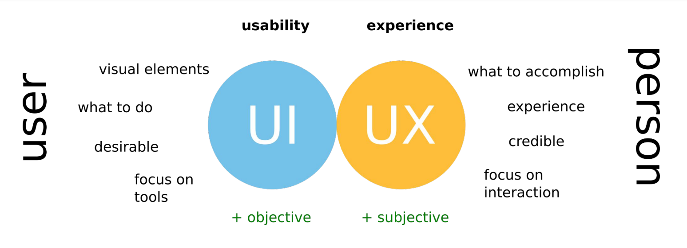

# 1 - Introdução

Tudo que nos rodeia, incluindo dispositivos tecnológicos, relógios, interruptores, portas, apresentam diversas soluções para problemas do quotidiano e são desenhadas para serem usadas. Esta interação entre o ser humano e o computador é feita por questões de comodidade e atualmente a experiência do utilizador é um factor diferenciador no mercado. 

## 1.1 - Human-computer interaction (HCI)

É um campo multidisciplinar que estuda o design da tecnologia dos computador e em particular a interação entre o sistema e os humanos. Deve ter uma parte visível, a interface, para estimular o utilizador. Este último deve interagir com o sistema, realizar as suas tarefas e ter ao mesmo tempo feedback do sistema.  
Duas das grandes áreas da interação são:

### 1.1.1 - User Experience (UX)

É toda a experiência subjectiva que o sistema pode proporcionar, desde a tecnologia ao marketing, unboxing, estética e emoções. Está envolvida em todo o contexto do produto e não só o artefacto em si.  
Ninguém cria a experiência do utilizador, mas sim o artefacto que leva a essa experiência. 

    
    
Figura 1: User Interface vs. User Experience

### 1.1.2 - User Interface (UI)

