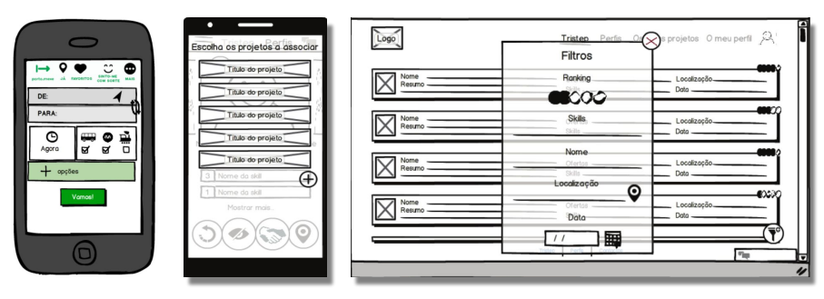

# Introdução

## 1 - Interação Pessoa Computador

Tudo que nos rodeia, incluindo dispositivos tecnológicos, relógios, interruptores, portas, apresentam diversas soluções para problemas do quotidiano e são desenhadas para serem usadas. Esta interação entre o ser humano e o computador é feita por questões de comodidade e atualmente a experiência do utilizador é um factor diferenciador no mercado. 

### 1.1 - Human-computer interaction definition (HCI)

É um campo multidisciplinar que estuda o design da tecnologia dos computador e em particular a interação entre o sistema e os humanos. Deve ter uma parte visível, a interface, para estimular o utilizador. Este último deve interagir com o sistema, realizar as suas tarefas e ter ao mesmo tempo feedback do sistema.  

#### 1.1.1 - User Experience (UX)

É toda a experiência subjectiva que o sistema pode proporcionar, desde a tecnologia ao marketing, unboxing, estética e emoções. Está envolvida em todo o contexto do produto e não só o artefacto em si.  
Ninguém cria a experiência do utilizador, mas sim o artefacto que leva a essa experiência. 

    
    
Figura 1: User Interface vs. User Experience

### 1.2 - User Centered Design (UCD)

Processo iterativo em que os designers focam nos utilizadores e nas suas necessidades em cada fase no processo de desenho do produto. Usam ferramentas investigativas como entrevistas ou formulários para conhecer o contexto dos utilizadores, perceber que os seus interesses poderão ser opostos ao que se estipula como normal.

## 2 - Design Process

O *Waterfall Model* assume que tudo já é completamente conhecido e especificado e testa a funcionalidade só depois da implementação, pelo que não é uma boa escolha para desenhar produtos que dependem da subjectividade dos utilizadores.  

Uma melhor solução é usar o *Iteractive Design Process*, que se compõem em curtas iterações e tem três fases principais de desenvolvimento:

1. Idealizar e desenhar;
2. Criar um protótipo;
3. Testar e avaliar, muitas vezes junto dos utilizadores finais, *stakeholders*;

Um protótipo pode ser feito em papel, que é menos moldável, ou usando um software próprio como o [PenPot](https://penpot.app).

    
    
Figura 2: Exemplo de protótipo de uma aplicação mobile

